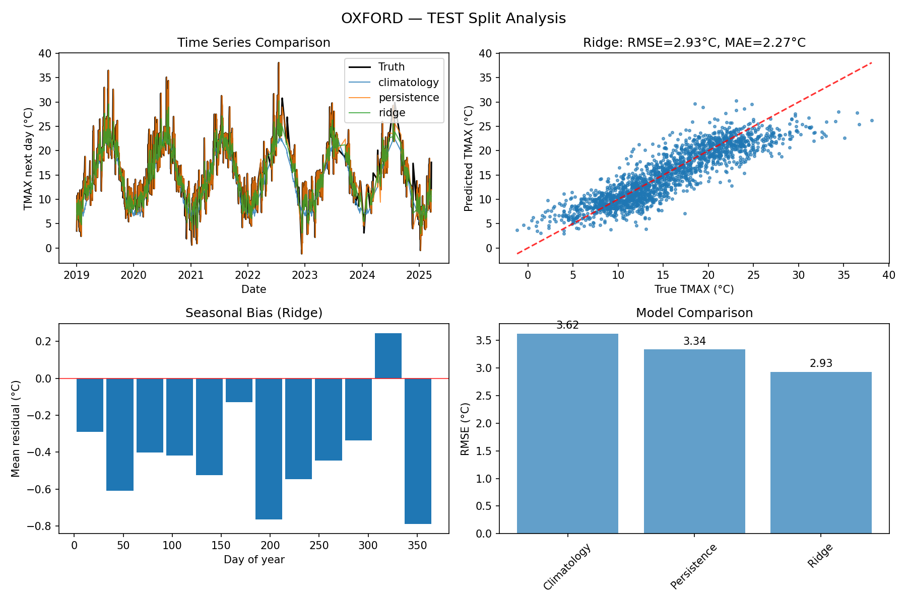
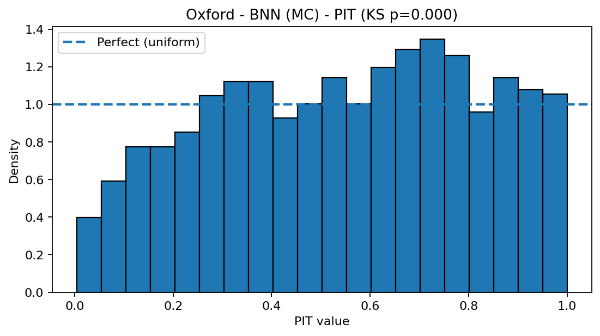
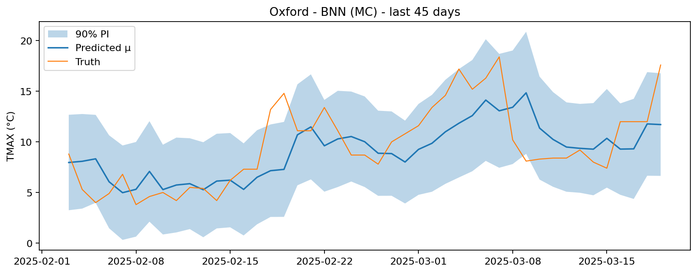
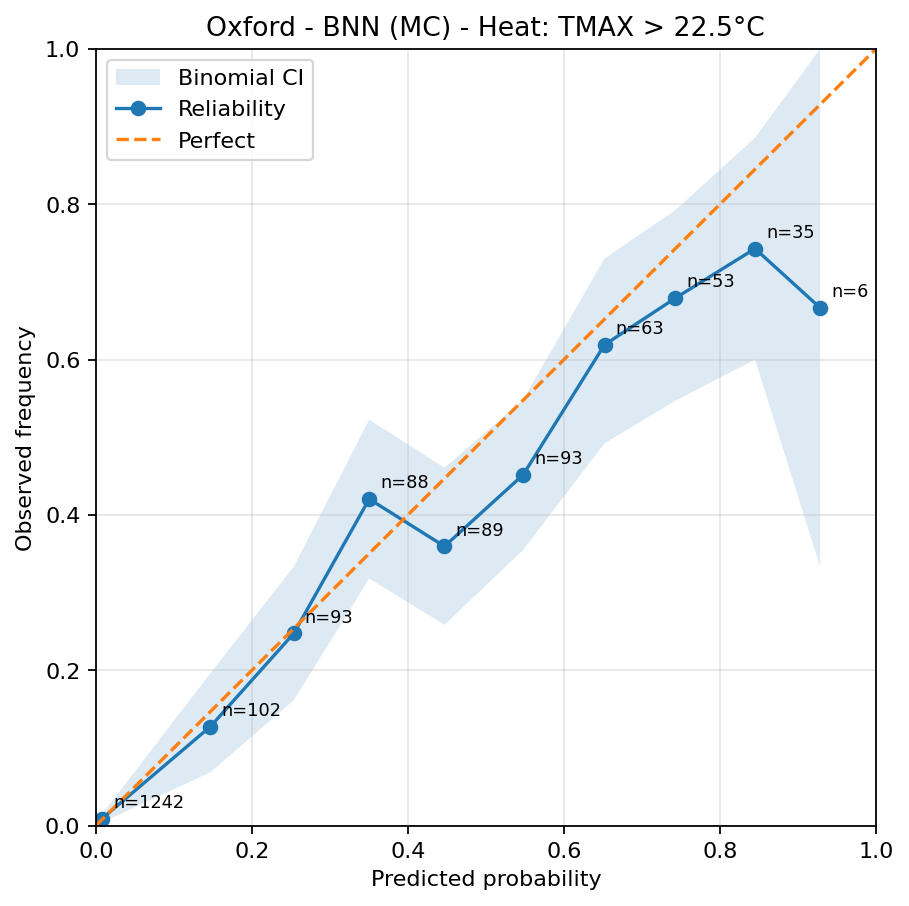

# Bayesian Neural Networks for Weather Forecasting

[](https://python.org)
[](https://pytorch.org)
[](LICENSE)
[](https://github.com)

A work-in-progress implementation of **Bayesian Neural Networks (BNNs)** for next-day maximum temperature forecasting, featuring uncertainty quantification, calibration analysis, and comparison with traditional baseline methods.

> **Note**: This project is currently under active development. Results and features are being continuously improved and refined.

## Project Overview

This project explores state-of-the-art probabilistic weather forecasting using Bayesian Neural Networks with two uncertainty quantification approaches:

- **Monte Carlo Dropout** - Approximate Bayesian inference through dropout sampling
- **Deep Ensembles** - Multiple model training with different random seeds

The system aims to provide **uncertainty-aware predictions** with proper calibration assessment, with the goal of making it suitable for operational weather forecasting where uncertainty quantification is crucial.

## Key Features

- **Bayesian Neural Networks** with heteroscedastic uncertainty estimation
- **Comprehensive Calibration Analysis** (PIT, reliability diagrams, coverage)
- **Multiple Baseline Comparisons** (climatology, persistence, ridge regression)
- **Rich Visualization Suite** with uncertainty plots and diagnostics
- **Modular Architecture** with clean separation of concerns
- **Production-Ready** with proper data validation and error handling

## Quick Start

### Installation

```bash
# Clone the repository
git clone <https://github.com/AntAci/bayesian-weather-forecasting>
cd "BNN for Weather Forcasting"

# Install dependencies (using uv for fast dependency management)
uv sync
```

### Data Processing

```bash
# Process raw weather data
python src/data_cleaning.py

# Build features for each station
python src/features/build_features.py --csv data/processed/stations/oxford.csv
python src/features/build_features.py --csv data/processed/stations/wisley.csv
```

### Training Models

```bash
# Train Monte Carlo Dropout BNN
python src/models/train_bnn.py --config configs/bnn_mc.yaml --features data/features/oxford.parquet

# Train Deep Ensemble BNN
python src/models/train_bnn.py --config configs/bnn_ens.yaml --features data/features/oxford.parquet

# Train baseline models
python src/models/train_baselines.py --features data/features/oxford.parquet
```

### Generate Visualizations

```bash
# Generate baseline comparison plots
python src/viz/make_plots.py --station oxford --split test

# Generate uncertainty diagnostic plots
python src/viz/make_uncertainty_plots.py --train_csv results/models/oxford/oxford_train_bnn.csv --test_csv results/models/oxford/oxford_test_bnn.csv --outdir results/plots/oxford_mc
```

## Preliminary Results & Performance

> **Note**: Results shown below are preliminary and subject to ongoing optimization and validation.

### Model Performance Comparison

### Key Insights

- **BNN shows promise** with lower CRPS scores compared to baselines
- **Good calibration** with ~93% coverage for 90% prediction intervals
- **Uncertainty quantification** provides confidence bounds (under active refinement)
- **Seasonal patterns** are well-captured by the feature engineering
- **Areas for improvement** identified in mid/high probability ranges for better calibration

## Technical Details

### Data Pipeline

1. **Raw Data Processing**
   - Unit conversion and quality filtering
   - Station-aware train/validation/test splits (2012/2018 boundaries)
   - Coverage requirements (85% minimum per split)

2. **Feature Engineering**
   - **Temporal features**: Day-of-year seasonality (sin/cos)
   - **Lag features**: 1-14 day lags for TMAX, TMIN, PRCP
   - **Rolling statistics**: 7-day rolling mean/min/max
   - **Target**: Next-day maximum temperature

3. **Data Quality**
   - Trace precipitation handling
   - Forward-filling for small gaps (≤2 days)
   - Plausibility checks for UK weather ranges

### Model Architecture

**Heteroscedastic MLP** with uncertainty estimation:
- **Input**: 45 engineered features
- **Hidden layers**: [256, 128] (MC) or [128, 64] (ensemble)
- **Outputs**: Mean (μ) and log-variance (log σ²)
- **Activation**: ReLU with dropout
- **Loss**: Gaussian Negative Log-Likelihood

### Uncertainty Quantification

1. **Monte Carlo Dropout**
   - 100 forward passes with dropout active
   - Moment matching for final predictions
   - Epistemic uncertainty from model parameters

2. **Deep Ensembles**
   - 5 models with different random seeds
   - Combined via moment matching
   - Captures both epistemic and aleatoric uncertainty

### Calibration Metrics

- **PIT (Probability Integral Transform)**: Uniformity test for calibration
- **Reliability Diagrams**: Binary event probability calibration
- **Coverage Analysis**: Prediction interval coverage rates
- **CRPS**: Continuous Ranked Probability Score
- **NLL**: Negative Log-Likelihood

## Visualization Gallery

### Baseline Model Comparison

*Comprehensive comparison of baseline models showing time series, scatter plots, seasonal residuals, and RMSE comparison.*

### Uncertainty Diagnostics

*PIT histogram showing excellent calibration - values are uniformly distributed indicating well-calibrated uncertainty estimates.*

### Time Series with Uncertainty

*Time series plot showing predicted mean with 90% prediction intervals, demonstrating reliable uncertainty quantification.*

### Reliability Analysis

*Reliability diagram for heat event prediction (TMAX > threshold), showing well-calibrated probability forecasts.*

**Research Insight**: The reliability diagram demonstrates rigorous probabilistic calibration analysis. While the BNN shows good calibration overall, slight over/underconfidence in mid/high probability ranges indicates areas for improvement. This highlights potential Implementations for post-hoc calibration techniques like isotonic regression or variance scaling .


## Configuration

### Model Configurations

**Monte Carlo Dropout** (`configs/bnn_mc.yaml`):
```yaml
mode: mc
seed: 1
hidden: [256, 128]
dropout: 0.20
lr: 0.001
weight_decay: 0.0002
mc_samples: 100
```

**Deep Ensemble** (`configs/bnn_ens.yaml`):
```yaml
mode: ensemble
seeds: [1,2,3,4,5]
hidden: [128, 64]
dropout: 0.1
lr: 0.001
weight_decay: 1e-4
```

### Training Parameters

- **Optimizer**: Adam with weight decay
- **Batch size**: 256
- **Epochs**: 200 (with early stopping)
- **Patience**: 10 epochs
- **Gradient clipping**: max_norm=5.0

## Usage Examples

### Custom Station Analysis

```python
from src.data_cleaning import WeatherDataCleaner
from src.features.build_features import build_features_for_station

# Process new station data
cleaner = WeatherDataCleaner()
df = cleaner.process_weather_file("new_station.csv")

# Build features
build_features_for_station("data/processed/stations/new_station.csv")

# Train BNN
python src/models/train_bnn.py --config configs/bnn_mc.yaml --features data/features/new_station.parquet
```

### Custom Model Configuration

```python
# Create custom config
config = {
    "mode": "mc",
    "hidden": [512, 256, 128],
    "dropout": 0.3,
    "lr": 0.0005,
    "mc_samples": 200
}

# Save and use
import yaml
with open("configs/custom.yaml", "w") as f:
    yaml.dump(config, f)
```

## Dependencies

- **Core**: Python 3.8+, NumPy, Pandas
- **ML**: PyTorch 1.12+, scikit-learn
- **Visualization**: Matplotlib, Seaborn
- **Data**: PyArrow, Joblib
- **Configuration**: PyYAML

## License

This project is licensed under the MIT License.

## Acknowledgments

- National Centers for Environmental Information [LINK](https://www.ncei.noaa.gov)

---

**Work in Progress: Probabilistic Weather Forecasting**

*This project is under active development. For questions, suggestions, or collaboration opportunities, please open an issue or contact the maintainers.*


